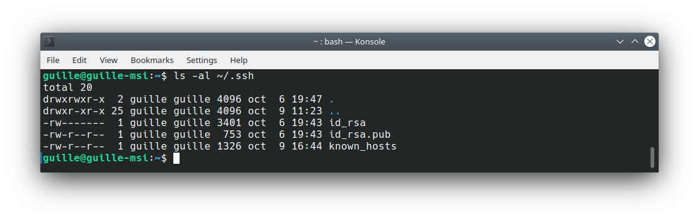
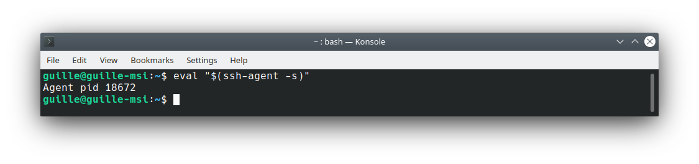
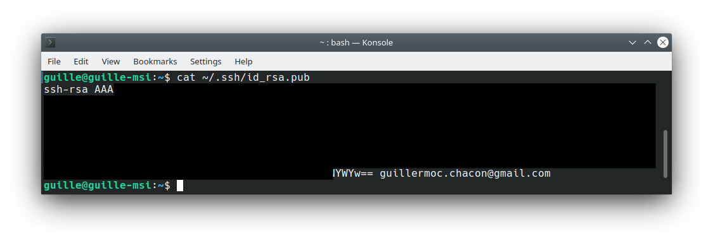
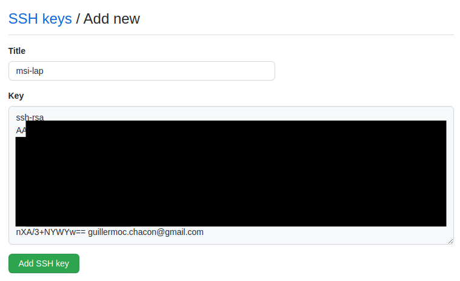
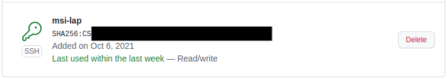
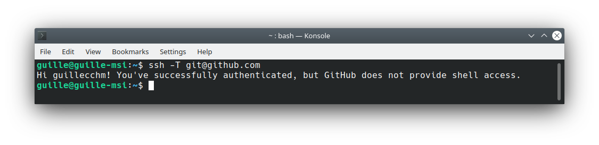
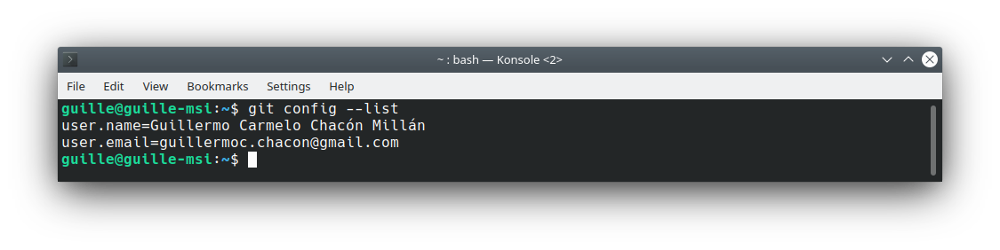
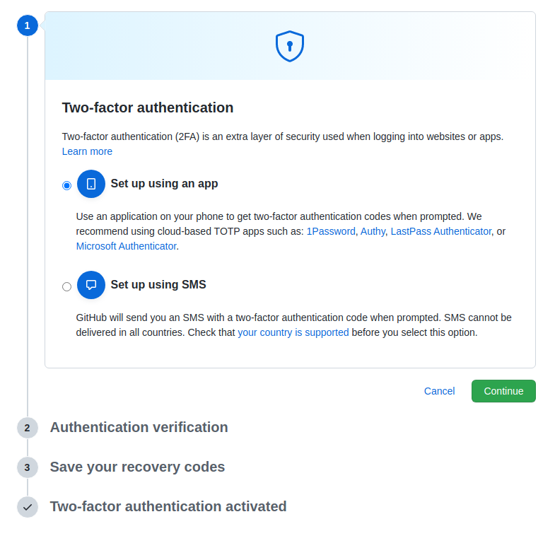
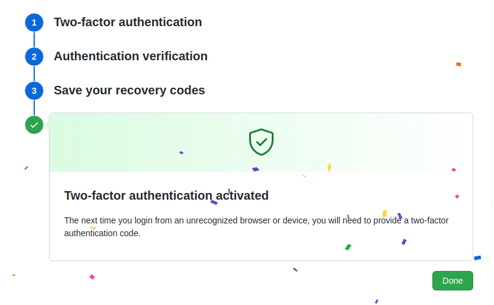

# Configuración inicial del repositorio
En este apartado de la documentación se describe la configuración inicial del entorno sobre el que se va a realizar la ejecución del proyecto.

## Establecimiento del par de claves pública-privada
La generación y configuración de las claves pública-privada se ha realizado siguiendo este [tutorial](https://docs.github.com/es/authentication/connecting-to-github-with-ssh/generating-a-new-ssh-key-and-adding-it-to-the-ssh-agent). Los pasos seguidos se encuentran descritos en los siguientes subapartados.

### Generación de un nuevo par de claves
La primera etapa se basa en la generación de un par de claves con las que realizar la autenticación contra el servidor de GitHub. Dicha generación puede realizarse con el siguiente comando:
```
ssh-keygen -t rsa -b 4096 -C "your_email@example.com"
```

El directorio por defecto en el que se almacenan las claves es *~/.ssh*. Si comprobamos el contenido de dicho directorio, se deben encontrar los archivos *id_rsa* (clave privada) e *id_rsa.pub* (clave pública). En la siguiente captura se muestra el listado del directorio *~/.ssh*:



### Adición de la clave privada al *ssh_agent*
El siguiente paso consiste en añadir la clave privada al *ssh_agent*. Antes de añadir la clave, hay que asegurarse de que el proceso se está ejecutando. Esta comprobación puede realizarse con el comando:
```
eval "$(ssh-agent -s)"
```
Si se está ejecutando, la salida mostrará el PID del proceso:



Finalmente, la adición de la clave privada al *ssh_agent* puede realizarse con el siguiente comando:

```
ssh-add ~/.ssh/id_rsa
```

### Subida de la clave pública a GitHub
El último paso consiste en subir la clave pública a la cuenta de *GitHub*. En primer lugar hay que copiar la clave pública generada, para lo que hay que mostrarla y copiarla en el portapapeles:

```
cat ~/.ssh/id_rsa.pub
```



Por último, hay que añadirla al perfil de *GitHub*. Esta acción se realiza en *Settings -> SSH and GPG Keys -> New SSH Key*:



Una vez añadida la clave pública, puede comprobarse que se encuentra disponible en *Settings -> SSH and GPG Keys*:



### Autenticación de ejemplo
Para comprobar que todo el proceso se ha realizado satisfactoriamente, se puede realizar una autenticación contra el servidor de github utilizando nuestra clave privada. Se realiza con el siguiente comando:

```
ssh -T git@github.com
```

La salida de dicho proceso debe indicar que se ha realizado la autenticación correctamente, tal y como se ilustra en la siguiente imagen:




## Configuración del nombre y correo electrónico para los commits
El establecimiento de la identidad para hacer los commits se basa en el establecimiento del nombre y el correo electrónico. Ambos ajustes pueden establecerse con los siguientes comandos:

```
git config --global user.name "John Doe"
```

```
git config --global user.email johndoe@example.com
```

Finalmente, para comprobar si los ajustes se han realizado correctamente, ejecutamos el comando para listar los ajustes de git:

```
git config --list
```



De forma adicional, se pueden establecer otros ajustes, como el editor de texto que se utiliza por defecto. En este [enlace](https://git-scm.com/book/es/v2/Inicio---Sobre-el-Control-de-Versiones-Configurando-Git-por-primera-vez) se muestran algunos ejemplos en el que se realizan ajustes iniciales de git.

## Completar la información del perfil de GitHub

La información del usuario de GitHub se establece en *Settings -> Profile*. Se ha cambiado la foto de usuario predeterminada y se ha establecido el nombre completo, ciudad y universidad:


## Establecimiento de la autenticación en dos pasos

La última configuración establecida se relaciona con la autenticación en dos pasos para incrementar la seguridad de la cuenta. En *Settings -> Account security -> Two-factor authentication* puede establecerse dicha característica. La ventana que aparece es la siguiente:



Como puede apreciarse, va a utilizarse el método de autenticación que emplea una aplicación adicional que proporciona el código. Una vez que se completan todos los pasos que indica la plataforma web, el resultado que se indica es el que se muestra en la siguiente captura:


